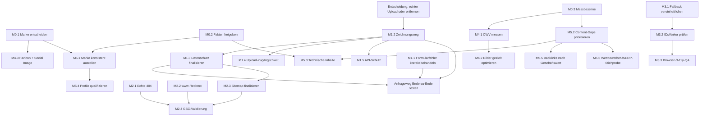

# Website Master Plan

Stand: 2026-08-29  
Prüfgegenstand: Repository-Stand, vorhandene SEO-Reports und CSV-Dateien sowie die öffentlich erreichbare Website `https://osmechplast.com/`  
Änderungsumfang dieser Aufgabe: ausschließlich dieses Dokument; keine Implementierung

## 1. Kurzurteil

Die Website ist technisch und inhaltlich deutlich weiter als die vorhandenen SEO-Reports vermuten lassen. Die acht kanonischen Seiten sind live erreichbar, haben individuelle Titles, Descriptions, Canonicals, H1 und strukturierte Daten. Die meisten als P0/P1 bezeichneten Report-Empfehlungen zu Sitemap, Schema, Analytics, Ankern, `/maschinenpark/` und Mindestwortzahlen sind deshalb veraltet, falsch oder überbewertet.

Die realen Prioritäten liegen an anderer Stelle:

1. Der Anfrageprozess meldet Erfolg, auch wenn das Speichern des Leads fehlschlägt.
2. Der angebotene Zeichnungs-Upload überträgt keine Datei; die Oberfläche bestätigt nur den Dateinamen.
3. Für die Verarbeitung personenbezogener Daten fehlt eine vollständige Datenschutzerklärung.
4. Wegen der fehlenden obersten `404.html` liefert Cloudflare Pages für beliebige Pfade die Startseite mit HTTP 200 aus; außerdem fehlt die Weiterleitung von `www` auf die kanonische Domain.

SEO-seitig ist daher kein pauschaler Relaunch und kein sofortiger Ausbau auf „2.000+ Wörter“ angezeigt. Zuerst müssen Anfrageweg, Datenschutz und URL-Verhalten korrekt sein. Danach sollen Search-Console-, Analytics- und Feldleistungsdaten entscheiden, welche Seite tatsächlich mehr Inhalt oder technische Optimierung benötigt.

### Prüfgrenzen

- Live geprüft wurden am 2026-08-29 Status, Weiterleitungen, Canonicals, `robots.txt`, `sitemap.xml` und ausgewählte Header.
- Ein echter Formular-POST wurde bewusst nicht ausgeführt, weil er einen Lead in der Produktivdatenbank erzeugt hätte. Die Fehlerlogik ist im Code eindeutig nachweisbar.
- Die bereitgestellte Datei `table-1787852234280.csv` ist nur ein Dateiverzeichnis; sie enthält keine Keyword-, Ranking- oder Search-Console-Messwerte. Die im Auftrag genannte Variante `table-1787852234280(1).csv` liegt nicht vor.
- Die visuelle Prüfung mit einem echten Desktop-/Mobilbrowser war in dieser Sitzung nicht möglich, weil keine Browserinstanz verfügbar war. Responsive CSS ist vorhanden; Darstellung, Kontrast, Fokusführung und reale Interaktion bleiben deshalb zu testen.
- Der PageSpeed-Insights-API-Aufruf wurde mit HTTP 429 abgewiesen. Es liegen deshalb keine belastbaren Lighthouse-, CrUX- oder Core-Web-Vitals-Werte vor.

## 2. Beweismatrix

Die Spalte „Ergebnis“ verwendet ausschließlich die geforderten Bewertungskategorien. „Live-Prüfung“ bezeichnet den Zustand vom 2026-08-29.

| ID | Behauptung | Ergebnis | Beweis im Code | Live-Prüfung | Quelle | Entscheidung |
|---|---|---|---|---|---|---|
| B01 | Beliebige nicht vorhandene URLs liefern die Startseite mit HTTP 200 (Soft-404). | bestätigt | Keine oberste `404.html`; `_redirects:1-33` enthält nur explizite Alt-URL-Weiterleitungen. | `/diese-seite-existiert-nicht-20260829/` → 200, 25.299 Byte, Canonical `/`; `/cnc-drehen/` → dasselbe. | [Cloudflare Pages: Serving Pages](https://developers.cloudflare.com/pages/configuration/serving-pages/), [Google: Crawl-Fehler und Soft-404](https://developers.google.com/search/docs/crawling-indexing/troubleshoot-crawling-errors) | Eine echte oberste 404-Seite ausliefern und unbekannte Pfade mit Status 404 beantworten; nicht fünf Scheineseiten einzeln behandeln. |
| B02 | Fünf benannte URLs enthalten exakte Startseiten-Duplikate und benötigen jeweils eine eigene SEO-Maßnahme. | teilweise bestätigt | Für diese Pfade gibt es keine eigenen Verzeichnisse; `_redirects:1-33` definiert sie nicht. | Die getestete `/cnc-drehen/` liefert wie jeder unbekannte Pfad die Startseite mit 200. Das ist ein gemeinsames 404-Fallback-Problem, keine fünfseitige Content-Architektur. | [Google: Duplicate URLs konsolidieren](https://developers.google.com/search/docs/crawling-indexing/consolidate-duplicate-urls) | Mit B01 zentral beheben; keine neuen Landingpages nur zur Reparatur des Fehlers anlegen. |
| B03 | `www.osmechplast.com` wird nicht auf `osmechplast.com` weitergeleitet. | bestätigt | Keine entsprechende Regel in `_redirects:1-33`; externe Cloudflare-Konfiguration ist nicht im Repository sichtbar. | `https://www.osmechplast.com/` → 200 mit Canonical auf non-www; `http://www...` → 301 auf `https://www...`, nicht auf non-www. | [Cloudflare: Redirecting `www` to apex](https://developers.cloudflare.com/pages/how-to/www-redirect/), [Google: Redirects](https://developers.google.com/search/docs/crawling-indexing/301-redirects) | Serverseitige 301/308-Weiterleitung von HTTP/HTTPS-www auf HTTPS-non-www einrichten und testen. |
| B04 | Die Sitemap enthält nur vier von mindestens 13 Seiten. | falsch | `sitemap.xml:5,13,19,25,31,39,45` enthält sieben kanonische URLs; `sitemap.xml:51-62` dokumentiert ausgeschlossene Scheindubletten. | `/sitemap.xml` → 200, gültiges XML, sieben URLs. | [Google: Sitemaps](https://developers.google.com/search/docs/crawling-indexing/sitemaps/overview) | Reportbefund verwerfen. Nur entscheiden, ob `/impressum/` bewusst ausgeschlossen bleibt oder als achte kanonische Seite aufgenommen wird. |
| B05 | Eine indexierbare `/maschinenpark/`-Seite sei `noindex`, dünn und müsse ausgebaut werden. | falsch | `_redirects:24` leitet `/maschinenpark.html` auf `/technologie/#maschinenpark`; `technologie/index.html:162-206` enthält den Maschinenpark-Abschnitt. Es existiert kein Verzeichnis `maschinenpark/`. | `/maschinenpark/` fällt derzeit unter B01 und liefert die Startseite mit 200; der aktive Altpfad `/maschinenpark.html` leitet korrekt weiter. | [Google: Redirects](https://developers.google.com/search/docs/crawling-indexing/301-redirects) | Keine separate Seite bauen, solange Search Intent und belastbare Maschinendaten dies nicht rechtfertigen; B01 reparieren. |
| B06 | Google Analytics/GTM fehlt vollständig. | falsch | `js/app.js:8-13` enthält GA4-ID und Clarity-ID; `js/analytics.js:5-7,50-84,118-179` implementiert Consent und bedingtes Laden. | Die Skripte sind in der Live-Auslieferung referenziert; tatsächliche Messdatenerfassung ohne Consent-/Analytics-Zugriff nicht abschließend geprüft. | [Google: Analytics- und Search-Console-Daten gemeinsam verwenden](https://developers.google.com/search/docs/monitor-debug/google-analytics-search-console) | Keine zweite GA4-Installation. Bestehende Property, Consent Mode, Events und Datenqualität mit Zugriff prüfen. |
| B07 | Fehlendes GA4 sei ein Ranking-Blocker. | falsch | Unabhängig davon ist GA4 bereits vorhanden (`js/app.js:8-13`). | Kein Rankingeffekt aus Live-Code ableitbar. | [Google: Technische Mindestanforderungen](https://developers.google.com/search/docs/essentials/technical) | Analytics als Messinstrument behandeln, nicht als Rankingmaßnahme. |
| B08 | Open Graph fehlt auf neun von 13 Seiten. | falsch | Alle acht kanonischen Dateien enthalten `og:type`, `og:locale`, `og:site_name`, `og:title`, `og:description`, `og:url`, z. B. `leistungen/index.html:62-67` und `kontakt/index.html:140-145`. | Metadaten werden live ausgeliefert. | [Open Graph Protocol](https://ogp.me/) | Keine pauschale OG-Nachrüstung; nur ein markengerechtes `og:image` nach Markenentscheidung ergänzen. |
| B09 | Strukturierte Daten fehlen auf fast allen Seiten. | falsch | JSON-LD beginnt in allen acht kanonischen Dateien, z. B. `index.html:27`, `leistungen/index.html:22`, `kontakt/index.html:22`, `impressum/index.html:23`; die vorhandenen Blöcke wurden als JSON geparst. | Live vorhanden; Rich-Result-Darstellung wurde nicht versprochen oder beobachtet. | [Google: Structured Data Policies](https://developers.google.com/search/docs/appearance/structured-data/sd-policies) | Keine flächige Schema-Neuerstellung. Vorhandene Aussagen nur nach Marken-/Unternehmensfreigabe validieren. |
| B10 | Fehlende `meta robots` auf einzelnen Seiten verhindere die Indexierung. | falsch | Auf vier Seiten fehlt die Direktive, Canonical und indexierbarer Inhalt sind aber vorhanden, z. B. `leistungen/index.html:6-10`. | Die Seiten liefern 200 und kein `noindex`. | [Google: Robots-Metatag; Standard ist Indexierung](https://developers.google.com/search/docs/crawling-indexing/special-tags) | Kein redundantes `index,follow` ergänzen. |
| B11 | Interne Links zeigen auf nicht vorhandene Anker. | falsch | Aktive Ziele existieren: `leistungen/index.html:162` (`cnc-drehen`), `technologie/index.html:164` (`maschinenpark`), `kontakt/index.html:238` (`leadForm`); die kanonischen Seiten und Module wurden gegengeprüft. | Die kanonischen Ziel-URLs und getesteten Alt-URL-Weiterleitungen sind erreichbar. | — | Reportliste nicht umsetzen. Nur im späteren Browsertest Scroll-/Fokusverhalten prüfen. |
| B12 | Es fehlt jede Breadcrumb-Auszeichnung. | teilweise bestätigt | Sichtbare Krümelpfade sind auf Inhaltsseiten vorhanden, z. B. `technologie/index.html:122`; JSON-LD `BreadcrumbList` ist in den Unterseiten enthalten, beginnend z. B. `technologie/index.html:22`. | Metadaten live vorhanden; Rich-Result-Eignung nicht mit dem Google-Test geprüft. | [Google: Breadcrumb Structured Data](https://developers.google.com/search/docs/appearance/structured-data/breadcrumb) | Kein P2-Gesamtumbau; lediglich bei späteren Templateänderungen konsistent halten. |
| B13 | `/leistungen/` und `/technologie/` seien ohne 2.000+ Wörter nicht rankingfähig. | überbewertet | Beide Seiten enthalten inzwischen gegliederte Leistungs-/Technikmodule; `leistungen/index.html:138-683`, `technologie/index.html:122-211`. | Beide Seiten liefern 200, individuellen Title, H1 und Canonical. Rankings wurden nicht bereitgestellt. | [Google: Helpful Content – keine bevorzugte Wortzahl](https://developers.google.com/search/docs/fundamentals/creating-helpful-content) | Keine Zielwortzahl. Inhalte nur anhand Suchanfragen, Conversion-Fragen und freigegebener technischer Fakten erweitern. |
| B14 | HTML-Entities in Title/Description seien ein SERP-Fehler. | falsch | Entities stehen regelkonform im HTML, z. B. `technologie/index.html:6-7`; der DOM-Text wird als normale Sonderzeichen interpretiert. | Live-HTML enthält gültige Entities. | [WHATWG HTML: Character references](https://html.spec.whatwg.org/multipage/syntax.html#character-references) | Keine rein kosmetische Massenänderung. |
| B15 | Der Kontakt-H1 enthalte wegen fehlender Leerstelle einen Textfehler. | überbewertet | `kontakt/index.html:214-217` trennt Hauptzeile und Hervorhebung mit ` `/`<em>`; reine Textextraktion verliert die visuelle Trennung. | Visuelle Browserprüfung noch offen. | — | Im Browser prüfen; nicht aufgrund des Report-Parsers umschreiben. |
| B16 | Es fehlt ein Favicon. | bestätigt | Keine `rel="icon"`-Referenz in den acht kanonischen HTML-Dateien und kein entsprechendes Root-Asset gefunden. | Browser-Tab-Darstellung wurde nicht visuell geprüft. | — | Nach Markenentscheidung als kleine Branding-/UX-Maßnahme ergänzen, nicht als Indexierungsblocker. |
| B17 | `og:image` fehlt. | bestätigt | Die vorhandenen OG-Blöcke enden jeweils bei `og:url`, z. B. `index.html:149-154` und `kontakt/index.html:140-145`. | Live-Metadaten enthalten kein `og:image`. | [Open Graph Protocol](https://ogp.me/) | Zusammen mit Favicon und finaler Marke umsetzen; geringe SEO-, aber reale Sharing-Relevanz. |
| B18 | Das Leadformular meldet Erfolg auch bei API-Fehlern. | bestätigt | `saveLead()` gibt bei Fehler `false` zurück (`js/app.js:142-157`); `submitForm()` ignoriert den Rückgabewert und trackt Erfolg, zeigt Erfolgsmeldung und leert das Formular (`js/app.js:179-190`). | Kein produktiver Fehler-POST erzeugt. Codepfad ist eindeutig. | — | Höchste Funktionspriorität: Erfolg nur nach bestätigtem API-Erfolg; verständlichen Fehlerzustand und Wiederholung ermöglichen. |
| B19 | Der angebotene Zeichnungs-Upload überträgt tatsächlich eine Datei. | falsch | Datei-UI in `modules/kontakt.html:44-50`; Payload ohne Datei in `js/app.js:166-178`; Handler zeigt nur den Namen (`js/app.js:196-204`); API und SQL kennen kein Dateifeld (`functions/api/leads.js:6-16,22-51`). | Nicht destruktiv live getestet; Übertragung ist im gesamten Client-/Serverpfad nicht implementiert. | — | Sofort entscheiden: sicherer echter Upload oder Upload-Versprechen bis dahin entfernen. Keine Scheinbestätigung belassen. |
| B20 | Das Formular informiert vollständig über die Datenverarbeitung. | falsch | `modules/kontakt.html:52` enthält ausdrücklich „TODO – Datenschutzhinweis ergänzen“; `modules/footer.html:43` sagt „Datenschutz folgt“; keine Datenschutzseite vorhanden. | Kontaktseite und Footer liefern diese Hinweise live aus. | [DSGVO Art. 13](https://eur-lex.europa.eu/legal-content/DE/TXT/?uri=CELEX%3A32016R0679), [Garante: Cookie- und Tracking-Leitlinien](https://www.garanteprivacy.it/web/guest/home/docweb/-/docweb-display/docweb/9677876) | Vor weiterer Leadgenerierung vollständige, juristisch geprüfte Information und dauerhaften Footer-Link bereitstellen; tatsächliche Datenflüsse dokumentieren. |
| B21 | Der sichtbare Datei-Upload ist per Tastatur bedienbar. | falsch | Klickbarer `div` ohne `role`, `tabindex` oder Tastaturhandler (`modules/kontakt.html:45-49`); das native File-Input ist mit `display:none` verborgen. | Visueller Tastaturtest offen; der Markup-Pfad bietet keinen Fokuszugang. | [WCAG 2.2, Erfolgskriterium 2.1.1 Keyboard](https://www.w3.org/TR/WCAG22/#keyboard) | Bei Beibehaltung als natives Label/Button-Muster mit Tastatur-, Fokus- und Statusverhalten umsetzen. |
| B22 | Der ausgelieferte Fallback-Markup enthält keine doppelten IDs. | falsch | `leistungen/index.html:162,336,510` wiederholt `id="cnc-drehen"`; `kontakt/index.html:238,273,308` wiederholt `id="leadForm"` und weitere Formular-IDs. | Nach erfolgreichem Modul-Fetch ersetzt JS den Inhalt (`js/app.js:226-234`); vor/ohne erfolgreichen Fetch bleiben die Duplikate bestehen. | [WHATWG HTML: `id` muss dokumentweit eindeutig sein](https://html.spec.whatwg.org/multipage/dom.html#the-id-attribute) | Build-/Fallback-Quelle bereinigen, sodass initiales HTML und JS-Zustand jeweils nur eine Modulinstanz enthalten. |
| B23 | Die dreifachen Blöcke seien für jeden Nutzer dauerhaft sichtbar. | teilweise bestätigt | Dreifacher Fallback steht im initialen HTML; `js/app.js:226-234` ersetzt jeden `data-include`-Slot bei erfolgreichem Fetch. | Raw HTML dreifach; gerenderter Zustand konnte mangels Browserinstanz nicht visuell bestätigt werden. | — | Als Robustheits-, Validitäts- und Wartbarkeitsproblem beheben, aber nicht ohne Messung als dauerhaftes visuelles Liveproblem darstellen. |
| B24 | Qualitätsseite behauptet eine vorhandene ISO-9001-Zertifizierung oder garantierte Materialnachweise. | falsch | `qualitaet/index.html:279-288` sagt ausdrücklich: Lieferantennachweis wird auf Verfügbarkeit geprüft; ISO 9001 ist geplant und nicht als bestehend ausgewiesen. | Inhalt wird live so ausgeliefert. | — | Diese vorsichtige Aussage beibehalten; keine Zertifizierung oder Nachweisverfügbarkeit vorwegnehmen. |
| B25 | Die Aussage „Kunden in fünf Ländern“ ist als Unternehmensfakt belegt. | nicht anhand des Codes prüfbar | Behauptung in `unternehmen/index.html:191,195,200`; andere Seiten sprechen enger von Italien und DACH, z. B. `index.html:320` und `kontakt/index.html:123`. | Text ist live; Belege wie CRM-/Rechnungsdaten wurden nicht bereitgestellt. | — | Vor jeder weiteren Verwendung vom Inhaber belegen oder als Zielmarkt statt bestehender Kunden formulieren. |
| B26 | OSMP ist die freigegebene Website-Marke; ONCC ist nur eine Reportbezeichnung. | nicht anhand des Codes prüfbar | Aktiver Code nutzt OSMP/OS.MECHPLAST, z. B. `index.html:35,71`, `modules/header.html:7-12`; Reports und Aufgabenbriefing nennen ONCC. | Live-Site zeigt OSMP. | — | Verbindliche Markenentscheidung dokumentieren, bevor Logos, Metadaten, Schema, Social Assets oder mehrsprachige Texte geändert werden. |
| B27 | Die Wettbewerberanalyse belegt konkrete DACH-Wettbewerber und Content-Lücken. | benötigt externe Daten | `SEO_COMPETITORS.md:3-71,135-168` nennt Muster, aber keine prüfbaren Wettbewerber-URLs, Erhebungsdaten oder Keyword-/SERP-Belege. | Keine aktuelle Wettbewerber-/SERP-Erhebung war Bestandteil der gelieferten Daten. | — | Nicht als Beweis verwenden. Bei Bedarf definierte Suchbegriffe, Zielregionen, konkrete Domains und Beobachtungsdatum erheben. |
| B28 | Die Keyword-Zuordnung belegt Suchvolumen, Rankingchance und Bedarf an neuen Landingpages. | benötigt externe Daten | `SEO_KEYWORDS.md:1-153` enthält Zuordnungen, aber keine Volumen-, Ranking-, CTR- oder SERP-Datensätze; `table-1787852234280.csv:1-8` ist nur ein Dateiverzeichnis. | Kein Search-Console-/Keyword-Export vorhanden. | [Google: Search-Console-Leistungsdaten](https://developers.google.com/search/blog/2022/10/performance-data-deep-dive) | Erst Query-/Page-Daten für Deutschland, Österreich, Schweiz und Italien auswerten; danach Content-Gaps priorisieren. |
| B29 | Alle im Backlink-Plan genannten Profile und Verbände sind sofort sinnvoll. | benötigt externe Daten | `SEO_BACKLINK_PLAN.md:17-48,117-123` priorisiert u. a. Google Business, Xing, VDMA und VDA ohne dokumentierte Eignung, Kosten, Aufnahmebedingungen oder Referral-/Leadpotenzial. | Profile, Mitgliedschaften und bestehende Citations wurden nicht geprüft. | [Google: Spam policies for web search](https://developers.google.com/search/docs/essentials/spam-policies) | Keine Listenabarbeitung. Nur seriöse Quellen nach Zielkundenrelevanz, Anspruchsberechtigung, Kosten und messbarem Nutzen auswählen. |
| B30 | Mobile Darstellung und Barrierefreiheit seien abschließend in Ordnung. | nicht anhand des Codes prüfbar | Viewport ist vorhanden; Responsive- und Reduced-Motion-Regeln existieren, z. B. `css/main.css:334,374-397` und `css/oncc-system.css:653-716,1242,1531`. B21/B22 zeigen zugleich konkrete Markup-Risiken. | Kein echter Browser/Viewport stand zur Verfügung. | [WCAG 2.2](https://www.w3.org/TR/WCAG22/) | Desktop/Mobil bei 320, 375, 768, 1024 und großer Breite sowie Tastatur, Zoom, Kontrast und Screenreader-Smoke-Test durchführen. |
| B31 | Core Web Vitals erfüllen LCP ≤ 2,5 s, INP ≤ 200 ms und CLS ≤ 0,1. | benötigt externe Daten | Große Assets sind vorhanden, u. a. `assets/img/hero-cnc-turning-center-workpiece.png` (2.095.024 Byte) und zwei Teamfotos über 1,8 MB; viele `img`-Elemente haben keine Abmessungen, z. B. `leistungen/index.html:126`, `qualitaet/index.html:128`. | PSI-API antwortete 429; keine CrUX-/Lighthouse-Werte. | [web.dev: Core Web Vitals und Schwellenwerte](https://web.dev/articles/defining-core-web-vitals-thresholds) | Erst Feld- und Labordaten erheben, dann pro Template LCP-/CLS-Ursachen beheben. Bildoptimierung ist plausibel, der konkrete Effekt aber zu messen. |
| B32 | `robots.txt` blockiert Suchmaschinen wegen der AI-Crawler-Regeln. | falsch | Lokales `robots.txt:1-25` erlaubt normale Suche und verweist auf die Sitemap. | Cloudflare ergänzt Regeln für ausgewählte AI-/Training-Crawler; Google-Websuche bleibt erlaubt. | [Google: robots.txt](https://developers.google.com/search/docs/crawling-indexing/robots/intro) | Nicht als SEO-P0 ändern. AI-Nutzungsregeln nur als bewusste Unternehmens-/Rechteentscheidung behandeln. |
| B33 | Die acht kanonischen Seiten haben keine eindeutige Onpage-Basis. | falsch | Alle acht Dateien haben individuellen Title, Description, Canonical und H1; Beispiele: `index.html:6-10,216`, `leistungen/index.html:6-10,132`, `kontakt/index.html:6-10,214`. | Alle acht kanonischen URLs liefern 200; Canonicals zeigen jeweils auf sich selbst. | [Google: SEO Starter Guide](https://developers.google.com/search/docs/fundamentals/seo-starter-guide) | Bestehende Basis bewahren; keine pauschale Metadaten-Neuschreibung. |
| B34 | Die Sitemap-Einreichung, Indexierung, Rankings und Conversions seien anhand der Dateien bewiesen. | benötigt externe Daten | `SEO_SEARCH_CONSOLE.md:56-167` ist eine Anleitung, kein Export; keine GSC-/GA-Rohdaten liegen vor. | Ohne Kontozugriff nicht prüfbar. | [Google: Performance-Daten und Dimensionen](https://developers.google.com/search/blog/2022/10/performance-data-deep-dive) | GSC-Property, Sitemap-Status, Page Indexing, Queries/Pages/Länder/Geräte sowie GA4-Events als Baseline exportieren. |
| B35 | Backend-Schutz und Fehlerbehandlung des Lead-Endpunkts sind vollständig. | nicht anhand des Codes prüfbar | Nur E-Mail-Pflichtprüfung in `functions/api/leads.js:18-20`; Rohfehler wird ausgegeben (`:53-55`), CORS `*` (`:59-84`); Rate Limits/CAPTCHA sind nicht im Repository sichtbar. | GET auf `/api/leads` → 405 wie erwartet; externe Cloudflare-Regeln wurden nicht eingesehen. | [OWASP: Input Validation Cheat Sheet](https://cheatsheetseries.owasp.org/cheatsheets/Input_Validation_Cheat_Sheet.html) | Externe Schutzregeln prüfen; serverseitige Validierung, neutrale Fehlerantworten, Größenlimits und Missbrauchsschutz risikobasiert ergänzen. |
| B36 | Der Search-Console-Bericht „Erlebnisse > Mobile Nutzbarkeit“ könne weiterhin monatlich geprüft werden. | falsch | Die Empfehlung steht in `SEO_SEARCH_CONSOLE.md:132-164`; sie beschreibt keinen Website-Code. | Kontozugriff lag nicht vor; Google hat den Mobile-Friendly Test und den Mobile-Usability-Bericht am 2023-12-01 eingestellt. | [Google: Mobile Friendly Test und Mobile Usability Report eingestellt](https://developers.google.com/search/blog/2016/05/a-new-mobile-friendly-testing-tool) | Anleitung aktualisieren, aber nicht in dieser Aufgabe. Mobile QA mit Browser/Lighthouse und reale Mobilprobleme über andere aktuelle Signale prüfen. |

## 3. Kritische Fehler

### K1 – Falsche Erfolgsmeldung im Anfrageformular

Der Rückgabewert von `saveLead()` wird ignoriert. Selbst bei HTTP-Fehlern werden ein Erfolgsevent gesendet, die Erfolgsmeldung eingeblendet und alle Eingaben gelöscht. Das kann qualifizierte B2B-Anfragen unbemerkt vernichten und gleichzeitig falsche Conversion-Daten erzeugen. Dies ist der höchste bestätigte Geschäftsfehler.

**Abnahmekriterium:** Bei API-Fehler bleiben Eingaben und ausgewählte Datei erhalten, es wird kein Success-Event gesendet, und der Nutzer erhält einen verständlichen Wiederholungs-/Kontaktweg. Erfolg wird nur nach bestätigtem Speichern angezeigt.

### K2 – Scheinbarer Zeichnungs-Upload

Die Kontaktseite verspricht, eine Zeichnung zu senden. Tatsächlich wird nur der Dateiname angezeigt; weder Request noch API noch Datenbank verarbeiten die Datei. Das ist für technische Einkäufer besonders kritisch, weil die Zeichnung die Grundlage der Machbarkeitsprüfung ist.

**Abnahmekriterium:** Entweder wird eine Datei Ende-zu-Ende sicher übertragen, validiert, gespeichert, einem Lead zugeordnet und intern zugänglich gemacht, oder die Upload-UI und jedes entsprechende Versprechen werden entfernt. Eine bloße Dateinamen-Bestätigung ist unzulässig.

### K3 – Unvollständige Datenschutzinformation

Die Website verarbeitet Kontakt- und potenziell Zeichnungsdaten, verweist jedoch sichtbar auf ein TODO und bietet keine Datenschutzerklärung. Vor der Umsetzung muss der tatsächliche Datenfluss geklärt werden: Verantwortlicher, Zwecke, Rechtsgrundlagen, Empfänger/Auftragsverarbeiter, Speicherfristen, Betroffenenrechte, Analytics/Clarity und gegebenenfalls Dateispeicher. Dies ist keine Rechtsberatung; der finale Text soll für Italien/EU juristisch geprüft werden.

**Abnahmekriterium:** Vollständige, vom Verantwortlichen freigegebene Datenschutzerklärung ist dauerhaft verlinkt; der Formularhinweis verweist präzise darauf; Consent- und Datenschutzerklärung entsprechen den tatsächlich geladenen Diensten und Datenflüssen.

### K4 – Unbekannte URLs liefern 200 und die Startseite

Cloudflare Pages behandelt das Projekt mangels oberster `404.html` als Single-Page-App. Dadurch erhalten beliebige Pfade Startseiteninhalt und -Canonical mit Status 200. Das erzeugt Soft-404s, unklare Nutzerführung und potenziell unnötige Indexsignale. Der Report erkennt das Symptom richtig, deutet die fünf Beispielpfade aber fälschlich als fünf eigenständige Content-Probleme.

**Abnahmekriterium:** Eine zufällige nicht vorhandene URL und alle früher behaupteten Scheineseiten liefern eine echte 404-Antwort mit hilfreicher 404-Seite; gültige kanonische und Legacy-Routen funktionieren weiterhin.

### K5 – Doppelte Fallback-Inhalte und IDs im initialen HTML

Die generierten Seiten enthalten zentrale Module mehrfach. JavaScript ersetzt sie normalerweise nachträglich, doch initial, bei Fetch-Fehlern und für manche Prüfer bleiben dreifache Formulare bzw. Leistungsabschnitte bestehen. Das gefährdet Validität, Anker, Labels, Screenreader-Referenzen und robuste Bedienung.

**Abnahmekriterium:** Jede ID ist in jedem ausgelieferten Dokument eindeutig; ohne JavaScript bleibt genau ein vollständiger, benutzbarer Fallback; mit JavaScript entsteht derselbe semantische Inhalt ohne Duplikate.

## 4. Maßnahmen-Map

### Phase 0 – Entscheidungen und belastbare Baseline

| ID | Maßnahme | Grund | betroffene Dateien | Aufwand | Risiko | Abhängigkeit | Erfolgskriterium |
|---|---|---|---|---|---|---|---|
| M0.1 | Verbindliche Marke festlegen: OSMP oder ONCC | Code/Live-Site und Aufgabenbriefing widersprechen sich; spätere Metadaten-/Assetarbeit darf nicht doppelt erfolgen. | Entscheidungsdokument; später Header, Footer, Metadaten, Schema, Assets, Übersetzungen | klein | hoch bei falscher Entscheidung | Inhaberentscheidung | Ein schriftlich freigegebener Markenname samt Schreibweise und Verhältnis zu OS.MECHPLAST SRLS liegt vor. |
| M0.2 | Unternehmens- und Leistungsfakten freigeben | „Kunden in fünf Ländern“, Messmittel, Maschinen, Sprachen und Nachweise müssen belegbar sein. | `unternehmen/index.html`, `qualitaet/index.html`, `technologie/index.html`, Übersetzungen | klein | hoch bei erfundenen Aussagen | Inhaber/Fertigung | Freigabeliste unterscheidet bestätigte Fakten, geplante Fähigkeiten und zu entfernende Aussagen. |
| M0.3 | Messbaseline sichern | Ohne GSC-/GA4-/CrUX-Daten sind Ranking-, Content- und Performanceprioritäten Spekulation. | externe GSC-, GA4- und Cloudflare-Daten; keine Websiteänderung | klein | klein | Kontozugriffe | Export/Notiz mit Zeitraum, Queries, Seiten, Ländern, Geräten, Indexierung, Conversions und CWV vorhanden. |

### Phase 1 – Anfrageweg, Datenschutz und Missbrauchsschutz

| ID | Maßnahme | Grund | betroffene Dateien | Aufwand | Risiko | Abhängigkeit | Erfolgskriterium |
|---|---|---|---|---|---|---|---|
| M1.1 | Formularstatus korrekt behandeln und testen | Verhindert verlorene Anfragen und falsche Success-Events. | `js/app.js`, Test-/Staging-Konfiguration | klein | hoch | keine | Erfolgs-, 4xx-, 5xx-, Netzwerkfehler- und Doppelklick-Test bestehen; Eingaben gehen bei Fehler nicht verloren. |
| M1.2 | Sicheren Zeichnungsweg festlegen und umsetzen oder UI entfernen | Der derzeitige Upload ist funktional falsch; Zeichnungen können sensible technische Daten enthalten. | `modules/kontakt.html`, `kontakt/index.html`, `js/app.js`, `functions/api/leads.js`, D1/Objektspeicher/Benachrichtigung je nach Lösung | groß | hoch | Entscheidung Upload ja/nein; Speicher-/Zugriffskonzept | Datei wird mit Typ-/Größenlimit Ende-zu-Ende einem Lead zugeordnet und intern abrufbar, oder alle Upload-Versprechen sind entfernt. |
| M1.3 | Datenschutzerklärung und präzisen Formularhinweis bereitstellen | Personen-, Tracking- und gegebenenfalls Zeichnungsdaten brauchen transparente Information. | neue Datenschutzseite, `modules/footer.html`, `modules/kontakt.html`, kanonische Fallbacks, ggf. Sitemap | mittel | hoch | tatsächlicher Datenfluss aus M1.2; juristische Freigabe | Vollständige Seite ist erreichbar/verlinkt; Dienste, Zwecke, Fristen, Empfänger und Rechte stimmen mit der Technik überein. |
| M1.4 | Upload-Bedienung barrierearm machen | Der aktuelle Klick-`div` ist nicht per Tastatur erreichbar. | `modules/kontakt.html`, `kontakt/index.html`, CSS/JS | klein | mittel | M1.2 behält Upload bei | Native, fokussierbare Bedienung; Tastatur-, Fokus-, Fehler- und Status-Smoke-Test bestehen. |
| M1.5 | API validieren und Schutzkonfiguration prüfen | Der Endpunkt prüft nur das Vorhandensein einer E-Mail und gibt interne Fehlertexte zurück. | `functions/api/leads.js`, externe Cloudflare-Regeln | mittel | mittel | Uploadentscheidung beeinflusst Limits | Serverseitige Feld-/Größenlimits, neutrale Fehler, Rate-Limit/Missbrauchstest und dokumentierte Aufbewahrung vorhanden. |

### Phase 2 – Routing und Indexierung

| ID | Maßnahme | Grund | betroffene Dateien | Aufwand | Risiko | Abhängigkeit | Erfolgskriterium |
|---|---|---|---|---|---|---|---|
| M2.1 | Echte 404-Auslieferung herstellen | Behebt Soft-404 und alle Scheindubletten zentral. | neue oberste `404.html`, ggf. Cloudflare-Routing | klein | mittel | keine | Zufallspfad und fünf Report-Beispielpfade → 404; alle acht kanonischen URLs → 200; alle Legacy-Regeln weiter korrekt. |
| M2.2 | `www` dauerhaft auf non-www umleiten | Vereinheitlicht Hostsignale und Nutzer-URLs. | Cloudflare Redirect Rule/Domainkonfiguration, ggf. `_redirects` | klein | mittel | Domain-/Cloudflare-Zugriff | HTTP/HTTPS-www folgen genau einer dauerhaften Weiterleitung auf dieselbe HTTPS-non-www-Route. |
| M2.3 | Sitemap-Umfang entscheiden und bereinigen | Aktuell sieben statt acht kanonische Seiten; Kommentar nennt nicht existente Pfade. | `sitemap.xml` | klein | klein | Entscheidung zu Impressum/Datenschutz; M1.3 | Sitemap enthält ausschließlich bewusst indexierbare kanonische 200-URLs; Status in GSC erfolgreich. |
| M2.4 | Indexierung nach Routingfix prüfen | Erfolg ist nicht allein aus Code ableitbar. | Google Search Console | klein | klein | M2.1-M2.3 | URL-Prüfung und Page-Indexing zeigen keine neuen Soft-404-/Hostduplikat-Probleme; Sitemap verarbeitet. |

### Phase 3 – Robustes Markup und Zugänglichkeit

| ID | Maßnahme | Grund | betroffene Dateien | Aufwand | Risiko | Abhängigkeit | Erfolgskriterium |
|---|---|---|---|---|---|---|---|
| M3.1 | Modul-/Fallback-Erzeugung auf eine Instanz vereinheitlichen | Entfernt dreifache Formulare/Leistungsblöcke und verhindert Abweichungen zwischen Raw HTML und JS-Zustand. | `leistungen/index.html`, `kontakt/index.html`, Generator-/Modulworkflow, `js/app.js` | mittel | mittel | bestehende Include-Strategie verstehen | Raw HTML und gerenderter DOM enthalten je Modul genau eine Instanz; Seite bleibt ohne JS nutzbar. |
| M3.2 | IDs, Labels, Anker und Formularzuordnungen automatisiert prüfen | Doppelte IDs können Bedienung und Accessibility-Beziehungen brechen. | alle kanonischen HTML-Dateien und Module | klein | mittel | M3.1 | HTML-/DOM-Prüfung meldet keine doppelten IDs; alle `for`, ARIA-Referenzen und aktiven Fragmente lösen auf. |
| M3.3 | Visuelle und assistive QA durchführen | Responsive CSS allein beweist keine brauchbare Darstellung. | alle acht kanonischen Seiten | mittel | mittel | Browser/Testumgebung | Dokumentierte Tests für Viewports, 200%-Zoom, Tastatur, Fokus, Kontrast, Reduced Motion und Screenreader-Smoke-Test ohne Blocker. |
| M3.4 | Veraltete/gefährliche Übersetzungsschlüssel inventarisieren | Alte Schlüssel enthalten historische 24h-/Toleranz-/Materialversprechen; spätere Overrides machen den aktiven Zustand schwer prüfbar. | `js/translations.js`, Module | mittel | hoch bei unbedachtem Löschen | M0.1, M0.2; aktiven Key-Graph ermitteln | Jeder aktive Textschlüssel ist eindeutig, freigegeben und ohne unbelegte Leistungsversprechen; keine Regression der Sprachumschaltung. |

### Phase 4 – Performance, Sharing und technische Härtung

| ID | Maßnahme | Grund | betroffene Dateien | Aufwand | Risiko | Abhängigkeit | Erfolgskriterium |
|---|---|---|---|---|---|---|---|
| M4.1 | CWV je Seitentemplate messen | Verhindert Optimierung nach Dateigröße allein. | externe PSI/CrUX/Lighthouse-Daten | klein | klein | Browser/API-Zugriff, ausreichende Felddaten | Mobile/ Desktop-Labordaten dokumentiert; Felddaten am 75. Perzentil, soweit verfügbar. |
| M4.2 | Priorisierte Bilder optimieren und Dimensionen stabilisieren | Mehrere PNGs sind 1,1–2,1 MB; fehlende Maße können Layoutverschiebungen begünstigen. | `assets/img`, `assets/images`, `assets/team`, betroffene HTML/CSS | mittel | mittel | M4.1 | Visuelle Qualität bleibt ausreichend; Transfergröße und gemessene LCP/CLS verbessern sich; Breite/Höhe bzw. `aspect-ratio` definiert. |
| M4.3 | Favicon und ein freigegebenes Social-Share-Bild ergänzen | Schließt bestätigte Branding-/Sharing-Lücken ohne Metadaten-Gesamtumbau. | neue Brand-Assets, acht kanonische HTML-Dateien/Template | klein | klein | M0.1 | Browser-Icons und Linkvorschau funktionieren; absolute `og:image`-URL erreichbar und passend beschnitten. |
| M4.4 | Security-/Cache-Header risikobasiert prüfen | Live sichtbar sind u. a. `nosniff` und Referrer-Policy; CSP/HSTS/Frame-/Permissions-Policy wurden nicht beobachtet. | Cloudflare-Konfiguration, `_headers` falls gewählt | mittel | mittel | vollständige Asset-/Script-Domainliste | Header-Test dokumentiert; gewählte CSP/HSTS-Strategie bricht Form, Consent, Fonts und Analytics nicht. |

### Phase 5 – Datenbasierter Content und Autorität

| ID | Maßnahme | Grund | betroffene Dateien | Aufwand | Risiko | Abhängigkeit | Erfolgskriterium |
|---|---|---|---|---|---|---|---|
| M5.1 | Marke und freigegebene Fakten konsistent ausrollen | Erst nach Entscheidung dürfen Logo, Namen und Unternehmensdaten systemweit vereinheitlicht werden. | Header, Footer, acht Seiten, JSON-LD, OG, Übersetzungen, Assets | groß | hoch | M0.1, M0.2 | Kein OSMP/ONCC-Widerspruch; juristischer Firmenname und Marke sind korrekt getrennt; Regressionstests bestanden. |
| M5.2 | Search-Intent-/Content-Gaps aus echten Daten priorisieren | Verhindert generische 2.000-Wörter-Texte und unnötige Landingpages. | zunächst Analyse; danach nur ausgewählte Seiten | mittel | mittel | M0.3, ausreichender Zeitraum | Jede Contentmaßnahme hat Query, Zielseite, Land, aktuelle Impression/Position/CTR, Nutzerfrage und Conversion-Ziel. |
| M5.3 | Technische Inhalte nur aus freigegebenen Fertigungsdaten ergänzen | B2B-Einkäufer brauchen belastbare Machbarkeitsinformationen, keine erfundenen Toleranzen/Kapazitäten. | `leistungen/`, `technologie/`, `werkstoffe/`, `qualitaet/` | mittel | hoch | M0.2, M5.2 | Jede Aussage ist intern belegt; Edelstahl bleibt nicht als Standardwerkstoff dargestellt; ISO 9001 bleibt als geplant gekennzeichnet. |
| M5.4 | Lokale Profile und Citations qualifizieren | Google Business/Verzeichnisse können sinnvoll sein, aber nur bei Eignung und konsistenten Firmendaten. | externe Profile | mittel | mittel | M0.1, M0.2; Berechtigung/Zugriff | Nur freigegebene Profile mit identischem Namen, Adresse, Telefon, Website und echter Pflegeverantwortung; Leads/Referrals werden gemessen. |
| M5.5 | Backlink-/Partnerarbeit nach Geschäftswert auswählen | Xing-, VDMA-/VDA- oder Verzeichnislisten sind ohne Eignungsprüfung keine Strategie. | externe Domains/Partnerschaften | groß | mittel | M5.2, Vertriebsprioritäten | Jede Quelle hat Zielkundenbezug, Aufnahmebedingung, Kosten, Verantwortlichen und messbares Ergebnis; keine gekauften/automatisierten Links. |
| M5.6 | Echte Wettbewerber-/SERP-Stichprobe durchführen | Der vorhandene Report liefert keine reproduzierbare Konkurrenzgrundlage. | neues Analyseartefakt; keine direkte Websiteänderung | mittel | klein | M0.3, definierte Zielqueries/-länder | Pro Zielthema sind Suchdatum, Land/Sprache, SERP, konkrete Domains, Seitentypen und belegte Content-Gaps dokumentiert. |

## 5. Reihenfolge

Nur echte Abhängigkeiten sind eingezeichnet; unabhängige Stränge dürfen parallel geplant werden.

Empfohlene Makroreihenfolge:

1. Phase 0: Entscheidungen und Baseline sichern.
2. Phase 1: Anfrageweg und Datenschutz korrekt machen.
3. Phase 2: Routing und Indexsignale bereinigen.
4. Phase 3: Markup-/Browserrobustheit herstellen.
5. Phase 4: Nur gemessene Performance- und Sharing-Lücken schließen.
6. Phase 5: Content und Autorität daten- und faktenbasiert ausbauen.

## 6. Nicht umsetzen

| Empfehlung | Warum nicht |
|---|---|
| Fünf neue Landingpages für `/cnc-drehen/`, `/cnc-dreh-fraesen/`, `/prototypen-serien/`, `/pruefung-dokumentation/`, `/anfrage-vorbereiten/` nur wegen des Reports | Die Pfade sind Symptome des allgemeinen SPA-/404-Fallbacks. Neue Seiten ohne nachgewiesenen Search Intent würden Architektur und Pflegeaufwand künstlich vergrößern. |
| Pauschal mindestens 1.500/2.000 Wörter auf Leistungs-, Technologie- oder Maschinenparkseiten schreiben | Google nennt keine bevorzugte Mindestwortzahl. Technische B2B-Inhalte sollen konkrete Nutzerfragen beantworten und dürfen keine Fähigkeiten erfinden. |
| Noch einmal GA4/GTM installieren | GA4 und Clarity sind bereits im Code. Eine Doppelinstallation verfälscht Daten; zu prüfen sind bestehende Property, Consent und Events. |
| Open Graph und Schema auf allen Seiten komplett neu bauen | Beide Grundlagen sind bereits vorhanden. Nur bestätigte Lücken (`og:image`, eventuell Detailvalidierung) gezielt schließen. Strukturierte Daten garantieren keine Rich Results. |
| Eine alte `/maschinenpark/`-Einzelseite reaktivieren und auf 1.500 Wörter aufblasen | Der gültige Maschinenpark ist Teil von `/technologie/`; die alte HTML-URL leitet dorthin. Eine eigene Seite braucht echte Nachfrage und belastbare technische Daten. |
| `index,follow` überall explizit ergänzen | Das ist der Standardzustand und löst kein aktuelles Problem. Zusätzliche Direktiven erhöhen nur Pflegeaufwand. |
| Alle Report-Anker entfernen | Die aktiven Ziel-IDs existieren. Entfernen würde funktionierende Navigation verschlechtern. |
| Breadcrumbs als globale P2-Neuentwicklung behandeln | Sichtbare Breadcrumbs und `BreadcrumbList` sind bereits vorhanden. Konsistenz prüfen genügt. |
| Xing, VDMA, VDA und jedes Verzeichnis aus der Liste sofort anlegen/bezahlen | Zielkundenrelevanz, Berechtigung, Kosten und tatsächlicher Referral-/Leadwert sind nicht belegt. Keine Checklisten-SEO. |
| ISO 9001, feste Toleranzen, 24-Stunden-Angebote, Werkstoffbreiten oder Lieferzeiten als Wettbewerbsvorteil ergänzen | Nicht belegte technische Versprechen sind für Einkauf und Qualitätssicherung geschäftlich riskant. ISO 9001 ist ausdrücklich nur geplant; Edelstahl ist kein Standardwerkstoff. |
| Neue Sprach-/hreflang-Seiten ohne echte separate URLs erzeugen | [Google empfiehlt eigene URLs je Sprachversion](https://developers.google.com/search/docs/specialty/international/managing-multi-regional-sites). Die aktuelle UI-Sprachumschaltung allein rechtfertigt kein umfangreiches internationales URL-System. |
| AI-Crawler-Regeln in `robots.txt` als SEO-P0 entfernen | Die Live-Regeln lassen Websuche zu und betreffen ausgewählte AI-/Training-Nutzung. Das ist eine Unternehmensentscheidung, kein belegter Google-Indexierungsfehler. |
| Title/Description nur wegen Zeichenanzahl oder HTML-Entities massenhaft umschreiben | [Google verwendet keine starre Title-Längenbegrenzung](https://developers.google.com/search/docs/appearance/title-link), und gültige Entities werden als Zeichen interpretiert. Änderungen brauchen CTR-/Query-Belege. |

Die drei wichtigsten ausdrücklich verworfenen Reportempfehlungen sind damit: **keine fünf Scheineseiten bauen**, **keine 2.000-Wörter-Pflicht**, **keine zweite Analytics-/Schema-Gesamtinstallation**.

## 7. Offene Fragen

1. Welche Marke ist verbindlich: **OSMP** oder **ONCC**? Wie lautet die exakte Schreibweise, und wie soll sie mit dem juristischen Namen OS.MECHPLAST SRLS erscheinen?
2. Soll ein Interessent wirklich Zeichnungen direkt hochladen können? Falls ja: Welche Dateitypen und Maximalgröße, welcher Speicherort, welche Aufbewahrungsfrist und welche internen Zugriffsberechtigten sind vorgesehen?
3. Wer verantwortet und prüft die Datenschutzerklärung für Italien/EU? Welche Auftragsverarbeiter bestehen für Cloudflare, D1/Dateispeicher, Google Analytics, Microsoft Clarity, Fonts und gegebenenfalls E-Mail?
4. Ist „Kunden in fünf Ländern“ durch reale Geschäftsbeziehungen belegbar, oder handelt es sich um Zielmärkte? Soll Frankreich strategisch sichtbar bleiben?
5. Welche Messmittel, Maschinenmodelle, Prüfprotokolle und Lieferantenzertifikate dürfen konkret öffentlich genannt werden?
6. Bestehen Zugriffe auf Google Search Console, GA4 und Cloudflare? Welche Personen dürfen Exporte bzw. Konfigurationsänderungen vornehmen?
7. Soll `/impressum/` bewusst nicht in der Sitemap stehen? Soll die künftige Datenschutzseite indexierbar und in der Sitemap enthalten sein?
8. Gibt es externe Cloudflare-Regeln für Rate Limiting, WAF, CORS, HSTS, Cache und Weiterleitungen, die im Repository nicht sichtbar sind?
9. Ist ein Google Business Profile für den Standort Ala bereits vorhanden und ist der Standort für die gewählte Profilart berechtigt? Empfängt das Unternehmen Kunden vor Ort oder arbeitet es als Produktions-/Servicebetrieb ohne Publikumsverkehr?
10. Welche Sprachen sollen langfristig eigene indexierbare URLs erhalten? Die aktuelle JS-Sprachumschaltung ersetzt keine klar definierte internationale SEO-Architektur.
11. Welche drei Leadereignisse gelten geschäftlich als Conversion: erfolgreich gespeicherte Anfrage, Klick auf E-Mail/Telefon und/oder tatsächlich eingegangene Zeichnung?

## 8. Empfohlener erster Arbeitsblock

Der erste Arbeitsblock umfasst maximal drei zusammenhängende Maßnahmen und verändert noch keine Marke, Seitenstruktur oder SEO-Texte:

1. **M1.1 – Formularfehler korrekt behandeln:** Erfolg nur nach bestätigter Speicherung, Fehlerzustand ohne Datenverlust, korrektes Analytics-Event.
2. **M1.2 – Zeichnungsweg entscheiden:** entweder einen sicheren Ende-zu-Ende-Upload spezifizieren oder die nicht funktionierende Upload-UI und das Versprechen vorläufig entfernen.
3. **M1.3 – Datenschutz vervollständigen:** den durch M1.2 festgelegten Datenfluss in eine juristisch geprüfte Datenschutzerklärung und einen präzisen Formularhinweis überführen.

Gemeinsames Ziel des Blocks: **Eine technische Einkaufsanfrage darf weder verloren gehen noch einen Upload vortäuschen, und der Nutzer muss vor dem Absenden nachvollziehen können, wie seine Daten verarbeitet werden.**

Vor dem ersten Code-Arbeitsblock ist eine Entscheidung zwingend: **Soll der Zeichnungs-Upload als echte Funktion umgesetzt werden, oder soll er bis zu einer sicheren Lösung aus der Kontaktstrecke entfernt werden?** Die Markenfrage M0.1 kann parallel entschieden werden, blockiert diese drei Korrekturen jedoch nicht.
